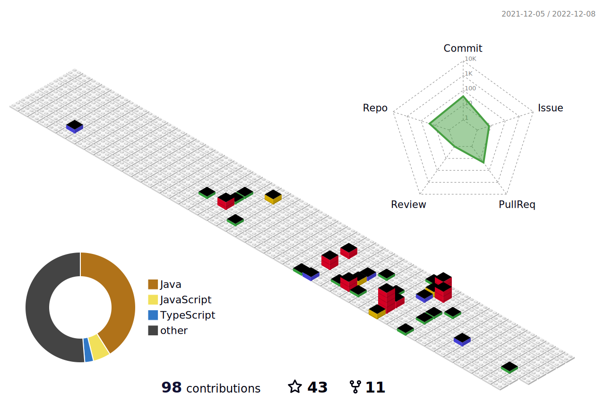

;神即是道,道法自然,如来;&font=Fira%20Code&center=true&width=380&height=50)



<p><em>Software Enginner at `Rock Home Town` </a></br>Developer Consultant at `JP` 
</em></p>


###  A little more about me...  

```javascript
const DamonXue = {
  lastName: "xue",
  code: [JAVA, Javascript, Golang],
  tools: [JAVA,Spring-Boot,Spring-Cloud],
  architecture: ["microservices", "event-driven", "design pattern"],
  communities: {
      apache: "Apache ShenYu Contributor",
  },
  hobby: ["Read", "Code"]
}
```
